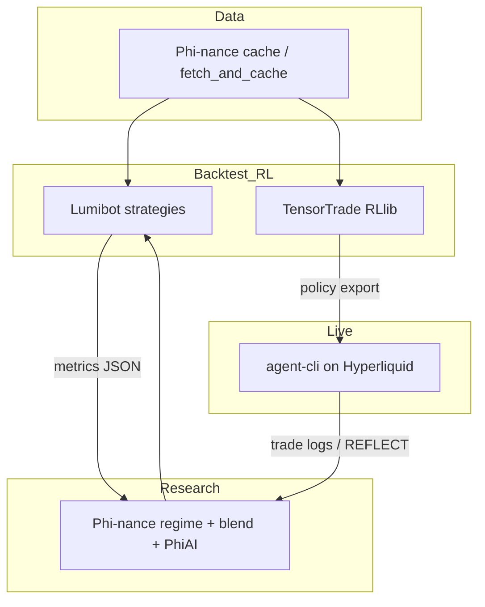

# Ecosystem integration — Phi-nance · Lumibot · TensorTrade · agent-cli

Phi-nance is the **research + data spine** in a four-repo workflow. This document describes how it connects to your forks without adding heavy optional dependencies to the core install.

| Repo | Role | Link |
|------|------|------|
| **Phi-nance** | Regime/signals, optimization, cached multi-vendor OHLCV, Streamlit workbench | this repo |
| **Lumibot** | Unified strategy API, broker backtests, rich data routing | [DGator86/lumibot](https://github.com/DGator86/lumibot) |
| **TensorTrade** | RL environments, Ray RLlib training | [DGator86/tensortrade](https://github.com/DGator86/tensortrade) |
| **agent-cli** | Hyperliquid live stack (APEX, Guard, REFLECT, MCP) | [DGator86/agent-cli](https://github.com/DGator86/agent-cli) |

## Architecture



## 1. Unified OHLCV (implemented here)

Use **`phi.data.unified_data`** so Lumibot and TensorTrade never fork fetch logic:

```python
from phi.data.unified_data import get_ohlcv, load_ohlcv_cached_first

df = get_ohlcv("SPY", "2023-01-01", "2024-12-31", "1D", vendor="unusual_whales")
df = load_ohlcv_cached_first("SPY", "2023-01-01", "2024-12-31", "1D", vendor="yfinance")
```

- Same parquet layout as `phi.data.cache` / Streamlit (`DATA_CACHE_DIR`).
- Optional **external hook** (e.g. live Hyperliquid) without importing agent-cli by default:

```bash
# module:attribute must be importable on PYTHONPATH
export PHINANCE_ECOSYSTEM_OHLCV_HOOK="my_bridge:get_hyperliquid_ohlcv"
```

Or pass `hook_import_path=` to `get_ohlcv_with_optional_hook(...)`.

## 2. Export bars for TensorTrade / notebooks

```bash
python scripts/export_ohlcv_for_rl.py --symbol SPY --start 2022-01-01 --end 2024-12-31 \
  --timeframe 1D --vendor yfinance --out ./exports/spy_1d.parquet
```

Point TensorTrade `DataFeed` builders at the exported file or call `get_ohlcv` inside a thin adapter in the TensorTrade repo.

## 3. Lumibot: PandasData-style feed

Lumibot can consume any `DataFrame` with OHLCV + `DatetimeIndex`. After `pip install lumibot` in a **dedicated** venv (or a composite image), subclass or wrap:

```python
# Pseudocode — run from a project that has both repos on PYTHONPATH
import pandas as pd
from phi.data.unified_data import get_ohlcv

df = get_ohlcv("SPY", "2020-01-01", "2024-01-01", "1D", "yfinance")
# Pass df or path into lumibot.entities.Asset / PandasData per Lumibot docs
```

See [Lumibot docs](http://lumibot.lumiwealth.com/) and your fork’s `docs/BACKTESTING_ARCHITECTURE.md`.

## 4. agent-cli strategies ↔ Lumibot / RL

- **Lumibot ↔ agent-cli**: implement a thin adapter in **agent-cli** or a small fifth “glue” repo that maps `MarketSnapshot` ↔ Lumibot bars; keep Phi-nance free of `hl` imports.
- **TensorTrade → agent-cli**: train in TensorTrade, export policy (pickle / ONNX / Ray checkpoint), then load from an agent-cli `BaseStrategy` `on_tick` (pattern in agent-cli `strategies/`).

## 5. Docker Compose (example)

An **example** multi-service layout lives at `deploy/docker-compose.ecosystem.example.yml`. Adjust build contexts to your local clone paths; Phi-nance does not ship Lumibot/TensorTrade/agent-cli as submodules.

## 6. Feedback loop (manual / scripted)

1. Run Lumibot backtest → export metrics JSON.
2. Feed constraints into Phi-nance PhiAI / walk-forward configs (`phi.phiai`, `phi.run_config`).
3. Redeploy parameters to agent-cli configs or Lumibot strategy files.

Automating that loop is repo-specific; start with `scripts/export_ohlcv_for_rl.py` and your metrics JSON schema.

## 7. QuantConnect (Lean) bridge

Export OHLCV + manifest (and optional options **signal card** JSON) for custom data or Object Store on QC:

- **Guide:** [quantconnect_deployment.md](quantconnect_deployment.md)
- **CLI:** `scripts/export_quantconnect_bundle.py`
- **HTTP (optional):** `phi.api.qc_export` with `pip install -e ".[quantconnect]"` or Docker `Dockerfile.qc-export` / Compose profile `quantconnect`
- **Lean starter:** `deployments/quantconnect/main.py` (copy into the QC web IDE)

---

**Related:** Unusual Whales REST + MCP — [API docs](https://api.unusualwhales.com/docs), [MCP guide](https://unusualwhales.com/public-api/mcp).
